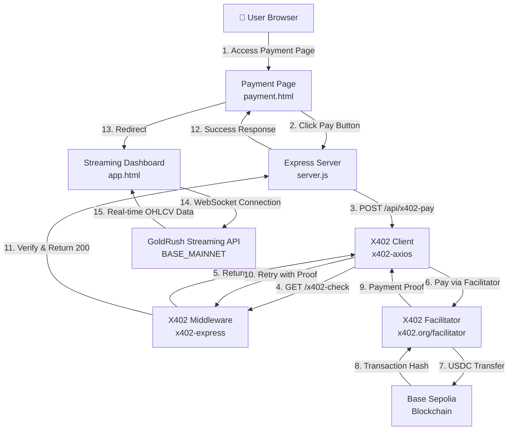
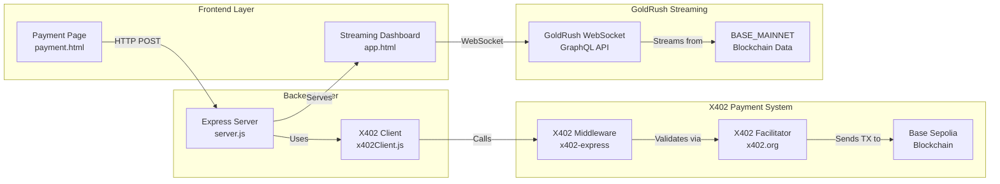
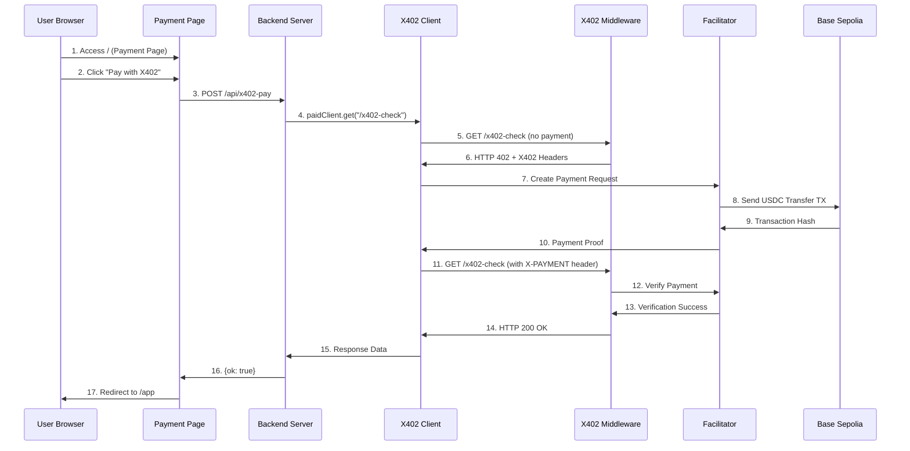
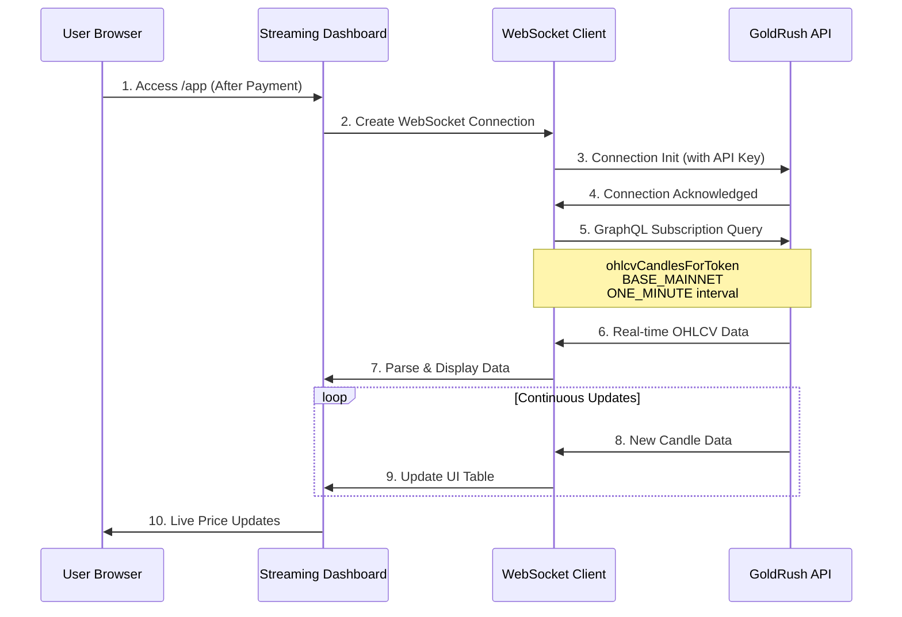
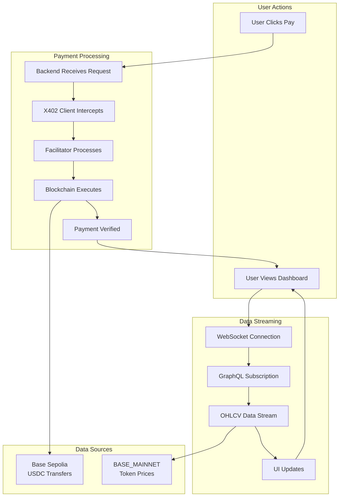
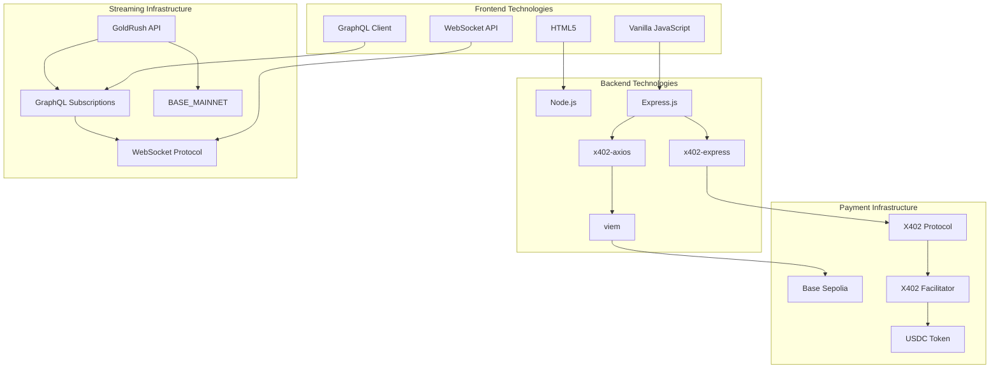
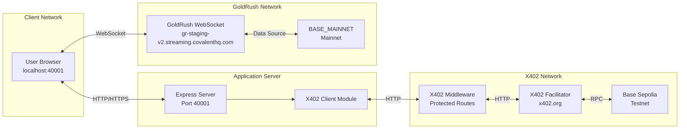

# System Architecture Diagram

## Overview

This document provides visual representations of the X402 + GoldRush application architecture, showing the complete flow from user interaction to real-time data streaming.

---

## High-Level Architecture



---

## Component Architecture



---

## Payment Flow Sequence



---

## Streaming Flow Sequence



---

## Data Flow Architecture



---

## Technology Stack



---

## Network Architecture



---

## ASCII Architecture Diagram (Alternative)

```
┌─────────────────────────────────────────────────────────────────┐
│                         USER BROWSER                            │
└─────────────────────────────────────────────────────────────────┘
                              │
                              │ HTTP GET
                              ▼
┌─────────────────────────────────────────────────────────────────┐
│                    PAYMENT PAGE (/)                             │
│                    payment.html                                 │
└─────────────────────────────────────────────────────────────────┘
                              │
                              │ POST /api/x402-pay
                              ▼
┌─────────────────────────────────────────────────────────────────┐
│                   EXPRESS SERVER                                │
│                   server.js (Port 40001)                        │
│  ┌──────────────────────────────────────────────────────────┐  │
│  │  POST /api/x402-pay                                       │  │
│  │    └─> Uses x402Client.js                                │  │
│  │         └─> paidClient.get("/x402-check")                │  │
│  └──────────────────────────────────────────────────────────┘  │
└─────────────────────────────────────────────────────────────────┘
                              │
                              │ GET /x402-check
                              ▼
┌─────────────────────────────────────────────────────────────────┐
│              X402 MIDDLEWARE (x402-express)                     │
│  ┌──────────────────────────────────────────────────────────┐  │
│  │  Protected Route: GET /x402-check                       │  │
│  │  - Returns 402 if no payment                             │  │
│  │  - Verifies X-PAYMENT header                             │  │
│  │  - Returns 200 if verified                               │  │
│  └──────────────────────────────────────────────────────────┘  │
└─────────────────────────────────────────────────────────────────┘
                              │
                              │ Payment Request
                              ▼
┌─────────────────────────────────────────────────────────────────┐
│              X402 FACILITATOR                                   │
│              x402.org/facilitator                               │
│  ┌──────────────────────────────────────────────────────────┐  │
│  │  - Receives payment authorization                         │  │
│  │  - Creates USDC transfer transaction                     │  │
│  │  - Sends to Base Sepolia                                  │  │
│  │  - Returns payment proof                                  │  │
│  └──────────────────────────────────────────────────────────┘  │
└─────────────────────────────────────────────────────────────────┘
                              │
                              │ USDC Transfer TX
                              ▼
┌─────────────────────────────────────────────────────────────────┐
│              BASE SEPOLIA BLOCKCHAIN                           │
│  ┌──────────────────────────────────────────────────────────┐  │
│  │  Transaction: 0x87e7927e...                             │  │
│  │  From: 0x27a03e8d... (Payer)                             │  │
│  │  To: 0x100278f4... (Receiver)                           │  │
│  │  Amount: 0.0001 USDC                                      │  │
│  └──────────────────────────────────────────────────────────┘  │
└─────────────────────────────────────────────────────────────────┘

                              │
                              │ After Payment Success
                              │ Redirect to /app
                              ▼
┌─────────────────────────────────────────────────────────────────┐
│              STREAMING DASHBOARD (/app)                        │
│              app.html                                           │
│  ┌──────────────────────────────────────────────────────────┐  │
│  │  - WebSocket Connection                                  │  │
│  │  - GraphQL Subscription                                  │  │
│  │  - Real-time OHLCV Display                               │  │
│  └──────────────────────────────────────────────────────────┘  │
└─────────────────────────────────────────────────────────────────┘
                              │
                              │ WebSocket (graphql-transport-ws)
                              │ + API Key Authentication
                              ▼
┌─────────────────────────────────────────────────────────────────┐
│              GOLDRUSH STREAMING API                             │
│              gr-staging-v2.streaming.covalenthq.com             │
│  ┌──────────────────────────────────────────────────────────┐  │
│  │  Subscription: ohlcvCandlesForToken                      │  │
│  │  - Chain: BASE_MAINNET                                    │  │
│  │  - Interval: ONE_MINUTE                                   │  │
│  │  - Timeframe: ONE_HOUR                                    │  │
│  │  - Real-time OHLCV data stream                           │  │
│  └──────────────────────────────────────────────────────────┘  │
└─────────────────────────────────────────────────────────────────┘
                              │
                              │ Data Source
                              ▼
┌─────────────────────────────────────────────────────────────────┐
│              BASE_MAINNET BLOCKCHAIN                            │
│  ┌──────────────────────────────────────────────────────────┐  │
│  │  - DEX Pair Data                                         │  │
│  │  - Token Price Data                                      │  │
│  │  - Trading Volume                                        │  │
│  └──────────────────────────────────────────────────────────┘  │
└─────────────────────────────────────────────────────────────────┘
```

---

## Key Components

### 1. **Payment Flow Components**
- **Payment Page**: User-facing interface for initiating payment
- **Express Server**: Handles HTTP requests and routes
- **X402 Client**: Manages payment interceptor logic
- **X402 Middleware**: Enforces payment requirements
- **Facilitator**: Processes and executes blockchain transactions
- **Base Sepolia**: Testnet blockchain for USDC payments

### 2. **Streaming Flow Components**
- **Streaming Dashboard**: Real-time data visualization interface
- **WebSocket Client**: Manages persistent connection
- **GoldRush API**: Provides GraphQL subscription endpoint
- **BASE_MAINNET**: Mainnet blockchain data source

### 3. **Data Flow**
- **Payment Data**: User → Backend → X402 → Blockchain
- **Streaming Data**: Blockchain → GoldRush API → WebSocket → Dashboard

---

## Security Considerations

1. **API Keys**: Stored in `.env` (not committed to git)
2. **Private Keys**: Securely managed via environment variables
3. **Payment Verification**: On-chain transaction verification
4. **WebSocket Authentication**: API key in connection init payload
5. **HTTPS/WSS**: Secure protocols for production deployment

---

## Scalability Notes

- **Stateless Backend**: Express server can be horizontally scaled
- **WebSocket Connections**: Each user maintains independent connection
- **Payment Processing**: Handled by external facilitator (no server load)
- **Caching**: Consider caching static data for performance

---

## Deployment Architecture

```
┌─────────────┐
│   CDN/      │
│   Static    │
│   Assets    │
└─────────────┘
      │
      ▼
┌─────────────┐      ┌─────────────┐
│   Load      │      │   Express   │
│   Balancer  │ ────▶│   Servers   │
└─────────────┘      └─────────────┘
      │                    │
      │                    ▼
      │              ┌─────────────┐
      │              │   X402      │
      │              │   Facilitator│
      │              └─────────────┘
      │
      ▼
┌─────────────┐
│   GoldRush  │
│   Streaming │
│   API       │
└─────────────┘
```

---

## File Structure Reference

```
x402-goldrush/
├── server.js              # Express server + X402 middleware
├── x402Client.js          # X402 payment client
├── package.json           # Dependencies
├── .env                   # Environment variables (not in git)
├── .gitignore             # Git ignore rules
├── README.md              # Setup instructions
├── GUIDE_TOC.md           # Guide table of contents
├── ARCHITECTURE.md        # This file
└── public/
    ├── payment.html       # Payment page
    └── app.html           # Streaming dashboard
```

---

## Legend

- **Solid Lines**: HTTP/HTTPS connections
- **Dashed Lines**: WebSocket connections
- **Arrows**: Data flow direction
- **Boxes**: Components/services
- **Subgraphs**: Logical groupings

---

*Last Updated: November 2025*

